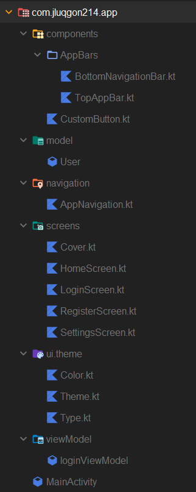

# Manual Técnico

## Manual Técnico de la Aplicación de Login para Android

### 1. Introducción

#### Objetivo del documento

Este documento tiene como objetivo proporcionar una guía técnica detallada de la aplicación de login para Android, incluyendo su estructura, requisitos y guía de instalación.

#### Resumen del proyecto

Esta aplicación permite a los usuarios registrarse e iniciar sesión. Consta de una pantalla de inicio, una pantalla de Inicio de sesión, una pantalla de registro y una pantalla de inicio autenticado con una barra de navegación superior e inferior y una ventana de configuración que ahora mismo lo que deja hacer es cerrar sesión.

#### Audiencia objetivo

Este documento está dirigido a desarrolladores, administradores de sistemas y personal de soporte técnico.

### 2. Descripción general del sistema

#### Visón general

La aplicación es una interfaz simple de autenticación que permite a los usuarios registrarse e iniciar sesión con credenciales predefinidas.

#### Arquitectura del sistema

La aplicación sigue un patrón MVVM para la separación de la lógica de negocios y la interfaz de usuario.

#### Tecnologías utilizadas

* Lenguaje: Kotlin
* Framework: Android Jetpack Compose
* IDE: Android Studio

### 3. Requisitos del sistema

#### Requisitos funcionales

* Registro de usuario con email, nombre y contraseña.
* Inicio de sesión con email y contraseña.
* Navegación entre pantallas.
* Cierre de sesión.

#### Requisitos no funcionales

* Interfaz simple y minimalista.
* Validaciones básicas en los formularios.

#### Requisitos de hardware y software

* Android Studio LadyBug o superior.
* Dispositivo o emulador con Android 7.0+.

### 4. Diseño técnico

#### Diagrama de arquitectura

<figure><figcaption></figcaption></figure>

#### Modelado de datos

La información de los usuarios se almacena dentro del propio codigo ahora mismo má adelante se le añadira una base de datos.

#### Flujos de trabajo

1. El usuario ingresa a la pantalla de inicio.
2. Puede iniciar sesión con credenciales predefinidas (email: "a", contraseña: "a").
3. Si no tiene cuenta, puede registrarse.
4. Tras iniciar sesión, accede a la pantalla de inicio autenticado.
5. Puede navegar entre la pantalla de inicio y la de configuración.
6. En configuración, tiene la opción de cerrar sesión y volver a la pantalla de login.

### 5. Detalles de implementación

#### Estructura del código

* `AppNavigation.kt`: Controla la navegación principal.
* `LoginScreen.kt`: Pantalla que maneja el inicio de sesión.
* `RegisterScreen.kt`: Pantalla que controla el registro de nuevos usuarios.
* `HomeScreen.kt`: Pantalla principal tras la autenticación.
* `SettingsScreen.kt`: Pantalla que contiene la opción de cierre de sesión.

### 6. Guía de instalación y despliegue

#### Requisitos previos

* Android Studio instalado.
* SDK de Android 7.0+ configurado.

#### Pasos de instalación

1. Clonar el repositorio del proyecto.
2. Abrir el proyecto en Android Studio.
3. Ejecutar en un emulador o dispositivo físico.

### 7. Pruebas

#### Estrategia de pruebas

* Pruebas manuales de flujo de usuario.

#### Casos de prueba

* Intentar iniciar sesión con credenciales incorrectas.
* Registrarse con un nuevo usuario.
* Navegar entre pantallas.
* Cerrar sesión y verificar redirección.

### 8. Mantenimiento y soporte

#### Guía de resolución de problemas

* Si la aplicación no abre, verificar compatibilidad con el SDK.

#### Historial de cambios

* v1.0: Versión inicial con funcionalidades básicas.

### 9. Seguridad

#### Políticas de seguridad

* Se recomienda implementar almacenamiento seguro en versiones futuras.

#### Plan de recuperación ante fallos

* Contactar con el desarrollador.

### 10. Anexos

#### Glosario de términos

* MVVM: Model-View-ViewModel.

#### Contacto

* Equipo de desarrollo: \[jluqgon214@g.educaand.es]
